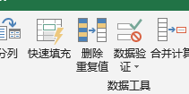

# init 
1. Djano pycharm 创建项目
2. scrapy startproject JobSpider
3. scrapy genspider zhaopin zhaopin.com 示例
4. pip install selenium,mitmproxy ...
# zhaopin.com
- [selenium与mitmproxy实现自动化数据爬取](https://www.codenong.com/cs106962946/)
- [api的都 失效了，selenium有检测机制](https://zhuanlan.zhihu.com/p/149760553)
-  2021.3.15 https://fe-api.zhaopin.com/c/i/sou?   url变更为position 

1. 先选获取所有type 职位大全type.txt
2. 根据type 一个一个的获取
3. 获取城市code

# 命令
```commandline
mitmweb -s addons.py

mitmdump 无ui  -s 无脚本插件
upstream:    upstream-auth 认证
 
```
运行命令：mitmweb -s addons.py 默认打开默认浏览器 8080端口
# tools 
[您覺得文字排序工具實用嗎？](http://gadget.chienwen.net/x/text/sort)

# 环境
chromedriver   89.0.4389.90
python3.9
# 快捷键生成local variables 
ctrl + alt + v 
以前好前alt enter 也是可以提示修复的，不这里是python

# mitmproxy 
一定要安装证书到根系统，否则https不显示或者，是pinning的问题
debug 
[只能反代理？](https://gist.github.com/tomsaleeba/c463550b43eb9c58d8b415523c49f70b)
或者使用cmdline命令来在pycharm中调试
3. https://zhuanlan.zhihu.com/p/161350888  python debug server 这个可以
4. mitmweb ui 资源占用，ui好，所以 mitproxy比较好，
5. 可以不用类，直接函数，在pycharm中运行配置怎么配置？命令行？。
# import机制
sys.path.append("../")#spiders与插件不在同一模块下，所以要加上路径。查一下import的机制就知道了。尽量反斜杠

# pYcharm热更新
https://blog.csdn.net/lly1122334/article/details/103957530
1. Evaluate  可以更改，但下一次执行呢？

2. Show Python Prompt
   - ```from importlib import reload→importlib.reload(module)```  不会用
   [pycharm hot reload](https://stackoverflow.com/questions/23333815/is-there-edit-and-continue-in-pycharm-reload-code-into-running-program-like-i)
热重载，最好是无状态的moudle ，否则，不行。与其他模块有关联的状态的话，是不行了
---
1. Work in Pycharm on a python project :-)
2. Execute your code in Debug mode (did not tried Release so far)
3. Edit some code in one your modules imported during the life of your program 
4. Make your program pause. To achieve this, you can click the "Pause" button of in PyCharms Debug view and then any place in your applications main window where it would need to do something (for example on a tab header). If you have a long a running task and no UI, you may place a breakpoint in a place your program often comes by.
5. In the Debug view, switch to the Console tab. There is a button on the left Show command line. Click this.
6. In the console, type in reload(MyModifiedModule) if this call fails, write import MyModifiedModule and try again.
7. Click resume in PyCharm.
8. Try the code you fixed.
# 输入框无法清除
0. 选中click(),focus
1. 双击，三击click()
2. keys.backspace n次
3.crtl a +backspace
4. 然后检查 value是否清除了

#浏览器插件爬虫调试
XSwitch 
webscrapy 
XHook
[devtools](https://docs.microsoft.com/zh-cn/microsoft-edge/devtools-guide-chromium/open/?tabs=cmd-Windows)
可能这种方法更快，不用写多少代码，那么多东西研究学习

# Terminal
终端修改
setting->搜索 terminal specify the powershell.exe or other 
# modify the todo style 
search todo in setting 
add pattern 
such as important things mark
```shell
\bTips\b.*
```
# 保存数据
elasticcsearch
curl
kiban 展示
数据分析保存数据库，再展示算静态了
再在kiban上加点操作加点动态的东西，自定义查询，分析由客户自己分析，nice,我只做处理

#正则表达式
\r 回车
\n 换行

#docker vnc chrome 

# myspider 路径问题
1. 要改是是zhaopin.py 、 scheduler.py、中的 projectDataDir,和 seleniumChrome.py的chromdriver路径，userdir 目录也改一下
2. 如果环境包目录问题，则 像 addons.py   放到项目根目录，并修改第1点中的目录
3. AutomationProfile 是userdir=xxx 登录信息会在里面

# 更多的chrome命令参照
[Chromium ](https://www.chromium.org/developers/how-tos/run-chromium-with-flags)

[chromium-command-line-switches](https://peter.sh/experiments/chromium-command-line-switches/)
# 数据日志文件非常大，几个g，全部放到一个数组是不行的？
，除非内存够大，不在乎性能，
-  首先想到生产-消费模式，但是，好像自己实现有点。。，要多线程。
-  用文件一边读，一边写，有加锁。。。
- 想到linux的管道grep，python有管道这个东西
- 缺点是日志中有重复的数据，浪费时间，1中的数组虽然可以去重。可以去重了，保存到文件，再管道吧，
- 或者重复是有规则的？？ 麻烦，直接文件覆盖得了，然后记录进行到的位置 ttributeError: module 'os' has no attribute 'fork 只能linux
用yield
# 详细页因为是html
所以不用mitproxy了，一堆网络问题，直接用selenium 来，缺点是文档结构不是reponse中的样貌，因为js会改变的，那直接禁止js加载，不行


# nosql 原因
第一，解析的json数据，mongo存储就是用json格式，读取和写入非常方便；第二，mongo不用提前设计表Schema，对我们这种临时性和不确定性的分析带来方便；第三，mongo可以存储海量的数据；第四，mongo会缓存热点数据，我们在后续分析时候读取会非常快。

主要是爬虫数据结构变化，与sql 解耦不太
# 数据库的设计
一个el
index
job 连到其它表越多，可搜索的就越多
表：
1. 大类表：9个，附上id
2. 职业表: kws 集合，附上id
3. job 表： 一个job一行。城市id 与jobid 共同为主键
   
   > job 增加两个类型：城市id与kw关键字id
4. 城市表：城市代码与城市
5. job详情表，url 作id
6. ~~公司表~~
   
# 数据清洗去重量化
pandas 二维数据 dataframes 
drop_duplicates()函数

去掉44%，网络问题
1. 去掉重复的，重复是城市id与job url id 共为主键下，不同。联合主键因为，同工作，可以不同城市，但却job url 指定的是一样的招聘信息
2. 清洗，去掉无用的数据，http code状态码之类的。其实也就是取list的内容而已
   > 1. 取list 
   > 2. 增加 城市id ,工作kw关键字，值为空的由pandas改为NAN
   > 3. 存储，按行存入文件
   > 4. 再存入数据库 mongoimport -d 数据库名 -c 集合名 --file 文件名 ~~--jsonArray~~
   > 5.  清洗之后，newtag "welfareLabel":[], citydi""的正则表达 删除，因为nosql不像sql 关系，结构 
3. **量化**
   > 工资不量化的话，统计的时候太难统计，尤其是有范围的数据
   > >目前要量化的有工资、万字转换为数字，好像有现成的了。。。 公司人数，人
   > 
   > job详情的，肯定要量化
   
## pandas 
要做的
0. 使用三维的还是二维的？生成json后，还要处理,二维的可以，转json还保持原样，关键是这个文件太大，一行一行存储（line=true）？？，或者直接写入数据库
1. 删除所有含缺失值的行，这个在处理完所有的文件后做
2. [同一文件增加列](https://www.geeksforgeeks.org/adding-new-column-to-existing-dataframe-in-pandas/) [add-new-col-df-default-value默认值](https://www.interviewqs.com/ddi-code-snippets/add-new-col-df-default-value)
3. 增加列后合并两个文件
4. [去掉无用的行](https://pandas.pydata.org/docs/reference/api/pandas.DataFrame.drop.html)
## 中文
UTF-8与unicode
    UTF-8 是变长的，1-6个字节，少数是汉字每个占用3个字节，多数占用4个字节，正则式为[\x80-\xff]{3}，这个都知道了吧。 
    unicode下，汉字的格式如\uXXXX，只要找到对应的字符集的范围，就能匹配相应的字串，方便从多语言文本中挑出所需要的某种语言的文本。不过，对于像日文这样的粘着语，既有中文字符，又有平假名片假名，或许结果会有所偏差。
————————————————
版权声明：本文为CSDN博主「CHENG Jian」的原创文章，遵循CC 4.0 BY-SA版权协议，转载请附上原文出处链接及本声明。
原文链接：https://blog.csdn.net/gatieme/article/details/43235791

# 快捷键
command + Alt + T 代码块包围(Try Except 等)

# 修改
## 量化
 return tmp.replace(r'^\s*$|\[\]', np.NaN, regex=True)  # 去掉空的值,用正则 TODO notepad++ 正则就行了是，**sb**
 - job detail
   这个先wo，四个目录一遍先，然后，再与数据库对比，看，缺了哪些。再输出到文件（按这个文件再爬一次），不然，错误中断继续太麻烦。，
   
# 开多线程/多进程
6. 不合并了，queue/list保存，最后read就行读出来
- 发送任务的队列:
task_queue = queue.Queue()
- 接收结果的队列:
result_queue = queue.Queue()
线程池，结果采集
数据队列
数据队列
   13:52:16
奇数，偶数
两两比较/相加  执行次数为 n-1次，最后都会剩下一个元素，所以判断多少次就行了
  
# 平行计算
[Pandas and Multiprocessing: How to create dataframes in a parallel way](https://python.plainenglish.io/pandas-and-multiprocessing-how-to-create-dataframes-in-a-parallel-way-72f9b18ea72f)
#  quantification 量化数据
  tmp.companySize = tmp.companySize.apply(lambda s: pd.Series(s.removesuffix("人"))) 还有1000人以上这种 字段,太多了吧

 return tmp.replace(r'^\s*$|\[\]', np.NaN, regex=True)  # 去掉空的值,用正则 TODO notepad++ 正则就行了是，sb

1. "" -> 保持
2. [] -> 保持？
3.  "state":0, -> '' 用正则删除
[正则表达式](https://developer.mozilla.org/zh-CN/docs/Web/JavaScript/Guide/Regular_Expressions)
    x(?!y)  仅仅当'x'后面不跟着'y'时匹配'x'，这被称为正向否定查找。
    [\w+(?=ing)，返回“str”，意思为：匹配以ing结束的单词](https://www.w3cschool.cn/regexp/cwp91pqg.html)
4. (\d+-\d+)人|(\d+)人以上 
。先将薪资水平字段值取平均值，再根据平均值所属的区间值进行划分。, 
   为0则是面议 
   经验水平，也是这样
   
5. 利用[andas DataFrame数据的增、删、改、查](https://blog.csdn.net/zhangchuang601/article/details/79583551)

这里要注意的一点是，我们有时会听到说python中的list对象不是线程安全的，这个说法是不严谨的，因为线程是否安全，针对的不是对象，而是操作。如果我们指这样的操作L[0] = L[0] + 1，它当然不是一个原子操作，不加以保护就会导致线程不安全，而L.append(i)这样的操作则是线程安全的。

作者：dwzb
链接：https://juejin.cn/post/6844903615824396295
来源：掘金
著作权归作者所有。商业转载请联系作者获得授权，非商业转载请注明出处。

# elasticsearch
## Starting a single node cluster with Docker
docker run -p 9200:9200 -p 9300:9300 -e "discovery.type=single-node" docker.elastic.co/elasticsearch/elasticsearch:7.12.0
python -m pip install elasticsearch
[Python进阶必学库：elasticsearch-py使用详解(上篇)](https://hackpython.com/blog/2019/06/28/Python%E8%BF%9B%E9%98%B6%E5%BF%85%E5%AD%A6%E5%BA%93%EF%BC%9Aelasticsearch-py%E4%BD%BF%E7%94%A8%E8%AF%A6%E8%A7%A3-%E4%B8%8A%E7%AF%87/)

docker --memory=4g 限制内存
更新参数
docker container update --restart=always 容器名字

# mongodb chart
#   cityid  换成 city名
mongodb集合中插入文档时，如果您没有在字段名称中添加带有_id的字段名称，
数字没有意义,而且中文一样可以关系型sql

# 让用户自己判断价值,我提供计算.def .用户需求太多...抽象,..思维

[在使用excel表格工作时，我们很经常接触输入相同的前缀或者后缀的情况](https://kknews.cc/zh-tw/career/yzpo4ej.html)。
加入 https+number+.htm 

> "cityId":\d+?,|"companyId":\d+?,|"companyNumber":.+?,|"companyRootId":.+?,|"website":\d+?,|"jobId":\d+?,
education 正则改为学历,或者pandas在初期的时候

> companySize(.+?)name(.+?)property(.+?)publishTime(.+?)salaryReal(.+?)skillLabel(.+?)welfareLabel(.+?)workCity
公司规模$1职位$2公司性质$3发布时间$4薪酬$5技能$6福利待遇$7工作城市 ，不是按顺序的就会不替换

_id 急招
"typeShowLabel":"
type:11急招

[Pandas remove null values when to_json](https://stackoverflow.com/questions/30912746/pandas-remove-null-values-when-to-json)
拼音搜索 

[
将Excel中的两列或多列数据汇总到一列](https://stackoverflow.com/questions/32291654/excel-append-one-range-to-the-end-of-another-in-one-column)
md,直接记事本,复制粘贴,不卡
然后去重


excel对比两列不同,
用记事本打开，不会卡 json.dumps("ברי צקלה", ensure_ascii=False).encode('utf8')
导入数据模块，web麻烦不实用   

哈工大停用词表,如的、在、于是、因此、一般、无论等等之类的词语，
称之为停用词，多次试验发现的在句子中没有实际意义且还频繁出现的词语，例如具有、深入、熟悉、
良好、较好、使用、一定
不需要英文,四字的停用词
Thank'sstop words lis 即：停止词列表 就是已经被搜索引擎认为是没有必要收录的词，可能这词没意思，或者这个词非常高的密度了。为了节约服务器资源，搜索爬虫就拒绝在收录这样的词了。
Simply change start = time.clock() to start = time.perf_counter() in the file: thulac/character/CBTaggingDecoder.py, the program will run well
或者改为jiaba module 'time' has no attribute 'clock' 

职位最多的分类 ，这还用k-means啊。直接分大类就行。
docker run    --link elasticsearch7:elasticsearch -p 5601:5601 -d --name kibana7 docker.elastic.co/kibana/kibana:7.12.0
- ./kibana.yml:/usr/share/kibana/config/kibana.yml

# es mapping 要在放入数据之前做。。。fuck
mongodb://host.docker.internal

```
mongodump -h dbhost -d dbname -o dbdirectory
```

mongorestore -d db_name -c collection_name /path/file.bson
https://github.com/mongodb/charts-demo

# 完成功能
- 地图 
  
  > 1. 筛选java的分布图。类推
- 词云
  
  > 谁的词云？技能（要分词）？福利？工作描述？  
- TextRank
  
  > 谁的排行？ 与谁有关的排行？
- 关系 
  
  > 
- 统计
  
  >表格
- 嵌入我的app，变成我的，伪动态，fuck 
pyecharts
分词增加列
scikit-learn¶ 聚类 KMeans 来把资料中近似的部分简化成同一类
~~# 插件开发~~
https://trumandu.gitbook.io/kibana-plugin-development-tutorial/wei-zhang/geng-duo-cha-jian-lie-biao
用测试数据，md，太慢了
改为TF-IDF 模式。大家都有的不要，与众不同的才叫特点
---
一袋子模型计数方法的时候。在计算的转换基础上。加入代码
```python
tfidfconverter = TfidfTransformer()
X = tfidfconverter.fit_transform(X).toarray()
```
全部用TFID 转换的话。这样写
Note:
You can also directly convert text documents into TFIDF feature values (without first converting documents to bag of words features) using the following script:
```python
from sklearn.feature_extraction.text import TfidfVectorizer
tfidfconverter = TfidfVectorizer(max_features=1500, min_df=5, max_df=0.7, stop_words=stopwords.words('english'))
X = tfidfconverter.fit_transform(documents).toarray()
```

  # 侧影法 判断k值。
# sql
等值连接：条件相等，表1 一行对扫表2 的每一行。 条件合的与，这两行拼接形成结果表的一行。
自然连接：在等值连接中把目标列中重复的属性列去掉
外连接 
> 左外连接：取出左侧关系中与右侧关系任一元组都不匹配的的元组，用空值填充所有来自右侧关系的属性。 产生的元组 加到自然连接的结果上。
> 右外连接：xxx产生的元组 加到自然连接的结果上。
> 全外连接：完成左和右外连接 产生的元组 加到自然连接的结果上。

关系代数运算
公式RxS
- 选择 是水平切割
- 投影 是垂直分割
- 连接 是RxS 的笛卡儿积中选取属性值满足一定条件的元组
- 除 是同时从关系的水平和垂直方向进行运算

术语：
关系：二维表
属性：列
值域：属性取值范围
元组：行
分量：元组的的第一个属性值称为元组的一个分量

---
boken 需要联网
SSE


# 增加在线分析功能 。嗯。nice 然后存入数据库。mongochart再出来。
正则表达式，it 不香？

for-in 缺点更加明显，它不仅遍历数组中的元素，还会遍历自定义的属性，甚至原型链上的属性都被访问到。而且，遍历数组元素的顺序可能是随机的。

嵌入到html 中，点击显示，再点击隐藏。看来还要抓几个网页才行。
1D6A96
85B8CB
d1dddb
283b42


# 嵌入大量图片，看它怎么查重：））））
需求量大的职位，根据时间。
nosql 扩展性，后期用途。
系统扩展性嘛，取数据自己分析吧。html扩展链接？步骤之间采用分离模式，加适配器就行。
提供两种方式，一种自己探索，第二种，我写好，展示给你。
Haystack

# 性能改进
 读取时间，应该是被缓存了。有缓存，比不了

dtype=false内存会少10%

---

| 操作            | 读取时间   | 合并时间  | 设置索引  | resetindex |        | 总共时间 |
| --------------- | ---------- | --------- | --------- | ---------- | ------ | -------- |
| merge           | 0.0880     | 0.2117852 |           |            |        |          |
| copy false      | 0.055463   | 0.03736   | 0.108461  |            |        |          |
| join set index  | 0.009214   | 0.009699  |           |            |        |          |
| 99万+184info    | 41.2381255 | 1.3706759 | 0.4182125 | 0.0235628  |        | 43.0509  |
| dtype=false内存 | 39.779510  | 1.332     | 0.343939  | 0.02419    | 140.55 | 41.481   |
| no drop nan     |            |           |           |            | 16.714 |          |
| 比率            |            |           |           |            |        |          |

# 生成目录树

linux下运行： tree -I 'venv|Test|\*AutomationProfile\*/*|Data|\*.log|\*__pycache__\*' -N

-N Print non-printable characters as is instead of as escaped octal numbers.

还是用nigx

```tree
.
├── analysis
│   ├── algorithm.py
│   ├── icu.py
│   ├── __init__.py
│   ├── machine_learn
│   │   ├── __init__.py
│   │   ├── product_predict.py
│   │   ├── random_forest.py
│   │   └── tflearn_ten.py
│   ├── mystopWord
│   │   └── 自定义停用词.txt
│   ├── stopWord
│   │   ├── 中文停用词库.txt
│   │   ├── 哈工大停用词表.txt
│   │   ├── 四川大学机器智能实验室停用词库.txt
│   │   └── 百度停用词列表.txt
│   └── 保留字.txt
├── Data
│   ├── category.json
│   ├── category.txt
│   └── model.pkl.bz2
├── dataView
│   ├── admin.py
│   ├── apps.py
│   ├── __init__.py
│   ├── utils.py
│   └── views.py
├── DP
│   ├── config.py
│   ├── dp_job_info.py
│   ├── dp.py
│   ├── drop_duplication.py
│   ├── dup_store.py
│   ├── Hub.py
│   ├── __init__.py
│   └── wash_quantify.py
├── ERDAV
│   ├── asgi.py
│   ├── __init__.py
│   ├── settings.py
│   ├── urls.py
│   └── wsgi.py
├── global_config.yaml
├── images
├── main_window.py
├── manage.py
├── myspider
│   ├── addons.py
│   ├── chromedriver.exe
│   ├── climb_types.js
│   ├── current_climb_progress.txt
│   ├── current_jobinfo_json_file.txt
│   ├── item_url_count.txt
│   ├── script.sh
│   ├── seleniumChrome.py
│   └── spiders
│       ├── config.py
│       ├── jobInfo.py
│       └── zhaopin.py
├── persistence
│   ├── config.py
│   ├── docker-compose.yml
│   ├── elastic.py
│   ├── __init__.py
│   └── mongodb-charts
│       └── charts-docker-swarm-19.12.2.yml
├── README.md
├── requirements.txt
├── static
├── templates
├── tree.txt
├── ui
└── utils
    ├── parse_yaml.py
    ├── pythontail.py
    ├── tail.py
    └── walk_file.py

17 directories, 99 files

```

# CMD命令

[cmd.exe 的命令行启动参数（可用于执行命令、传参或进行环境配置） - walterlv](https://blog.walterlv.com/post/cmd-startup-arguments.html)

Active code page: 65001 chcp 乱码

2、通过 chcp命令改变代码页，UTF-8的代码页为65001
chcp 65001

https://www.w3schools.com/python/ref_string_format.asp
print format 

计算图结构:


tflearn 默认tensorboard 为/tmp 
window  则是盘符：/tmp

qt_gui


adachi-shimamura@123456 mongo charts

